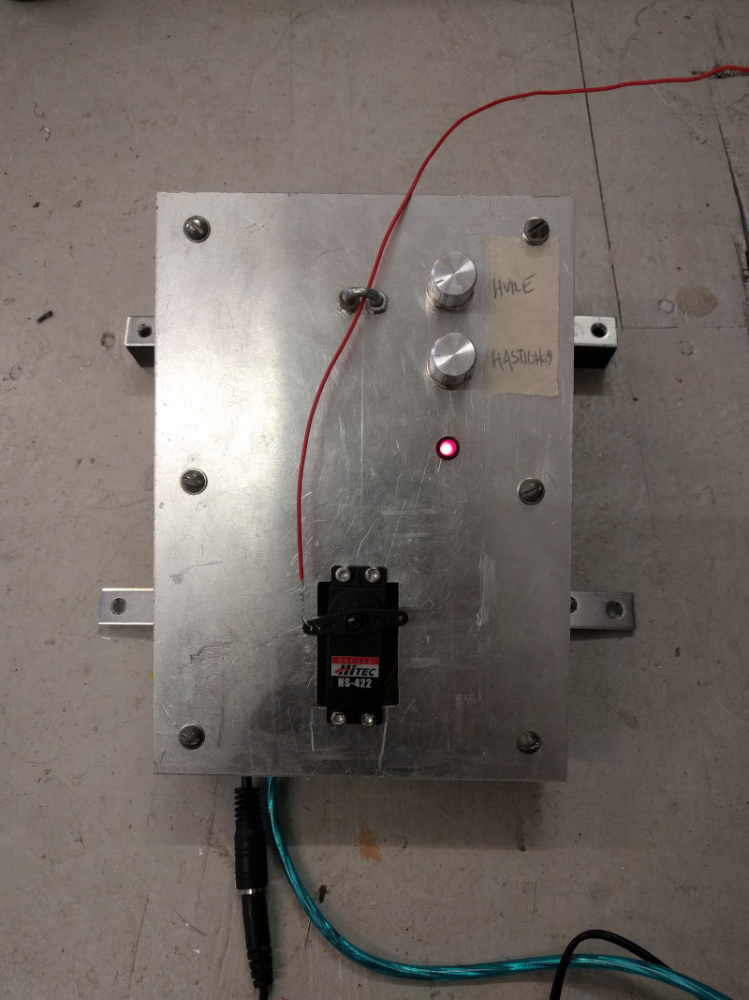

## stjerne radio, sprællemand
arduino kontrolleret servo motor som hiver i sprællemand

hardware: arduino uno, sparkfun wireless motor shield, hitec HS-422 servo.

 
sprællemand set igennem vinduet

 
hvile kontrollerer længden af pauser mellem bevægelser, 
hastighed kontrollerer motorens bevægelseshastighed

 
både arduino og servo motor deler samme strømforsyning: 5V center positiv

 
led er forbundet til pin 3, servo til pin 11, pontentiometre til A0 og A1

 
led er forbundet til pin 3, servo til pin 11, pontentiometre til A0 og A1

jacob remin, oktober 2020