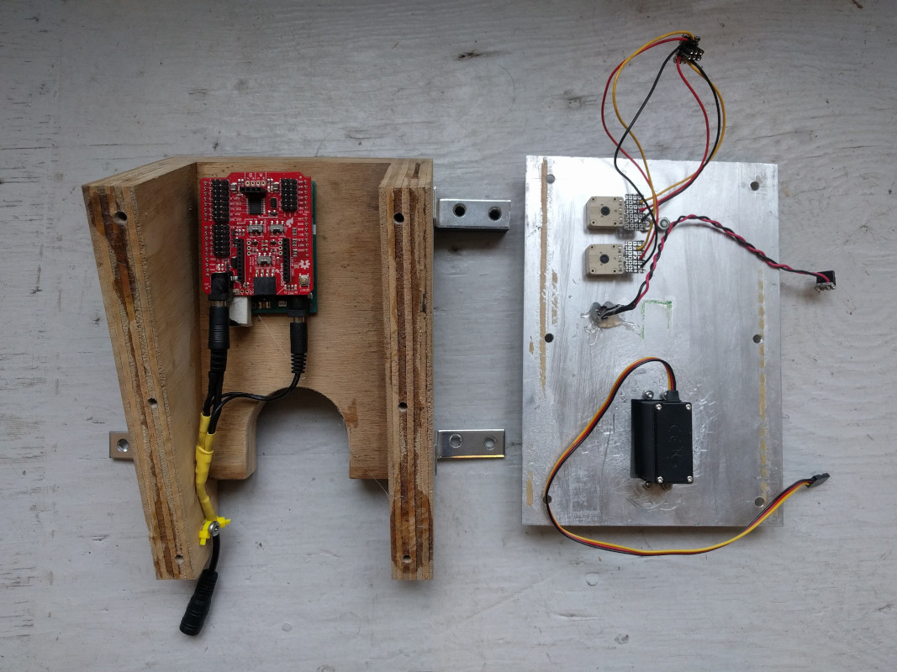
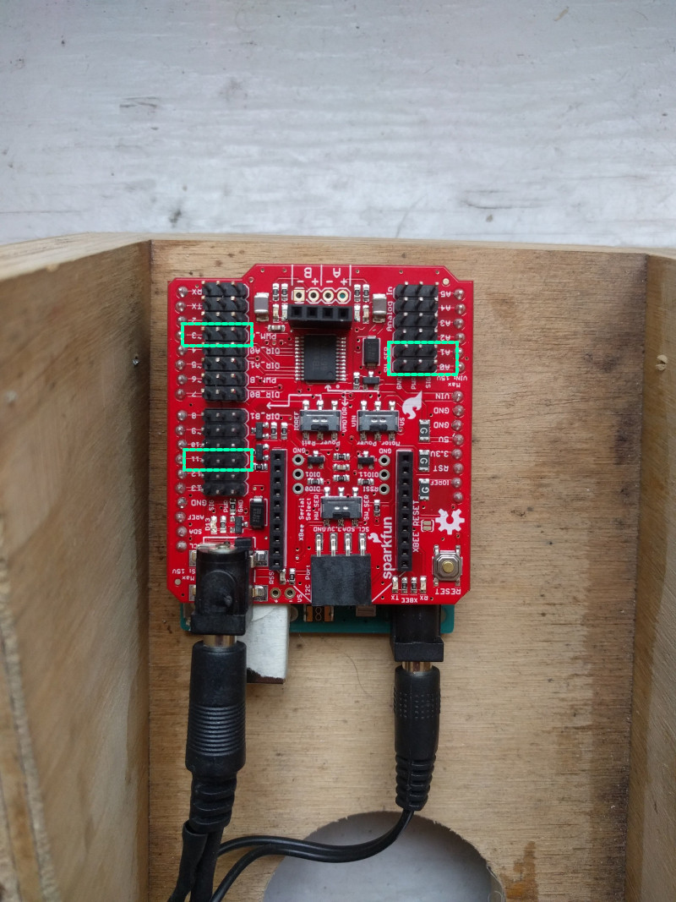
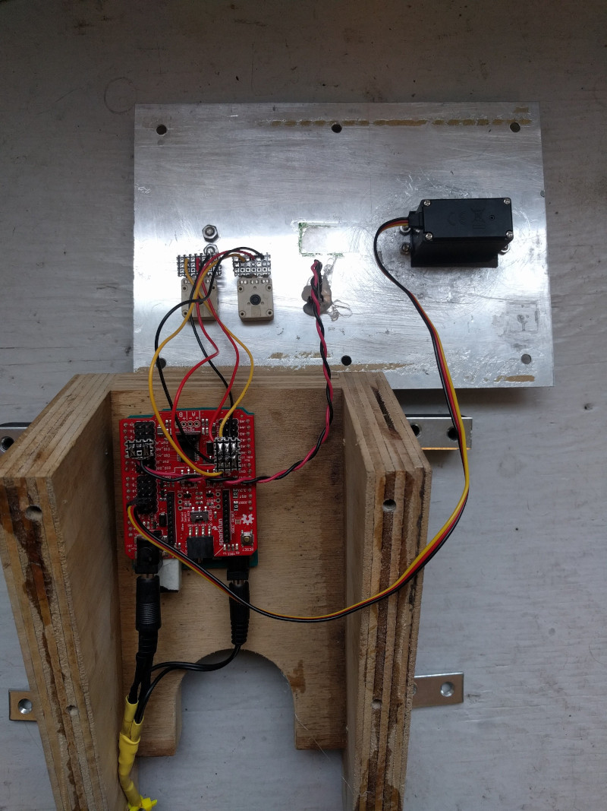

## stjerne radio, sprællemand
arduino kontrolleret servo motor som hiver i sprællemand

hardware: arduino uno, sparkfun wireless motor shield, hitec HS-422 servo.

sprællemand set igennem vinduet

jacob remin, oktober 2020